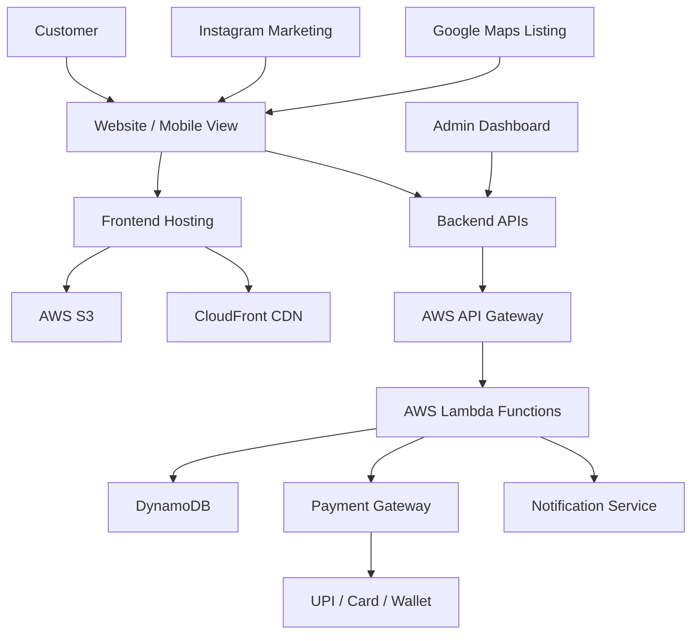

# Cruise Kitchen Architecture Diagram

```mermaid
flowchart TD

A[Customer] --> B[Website / Mobile View]

B --> C[Frontend Hosting]
C --> D[AWS S3]
C --> E[CloudFront CDN]

B --> F[Backend APIs]
F --> G[AWS API Gateway]
G --> H[AWS Lambda Functions]

H --> I[DynamoDB]
H --> J[Payment Gateway]

J --> K[UPI / Card / Wallet]

H --> L[Notification Service]

M[Admin Dashboard] --> F

N[Instagram Marketing] --> B
O[Google Maps Listing] --> B
```
