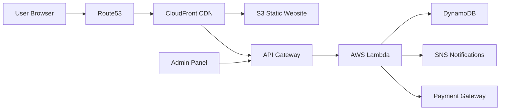

# AWS Deployment Architecture

---

# Deployment Components

| Component | AWS Service |
|---|---|
| Website Hosting | S3 |
| CDN | CloudFront |
| DNS | Route53 |
| APIs | API Gateway |
| Compute | Lambda |
| Database | DynamoDB |
| Notifications | SNS |
| Security | IAM + WAF |

---

# Deployment Steps

1. Create S3 Bucket
2. Enable Static Hosting
3. Configure CloudFront
4. Deploy Backend APIs
5. Configure Domain
6. Enable SSL
7. Setup Monitoring
